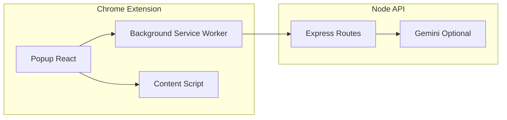

# Neuro-Inclusive Web Interface

Chrome Extension (Manifest V3) + Node.js API for neuro-inclusive reading support.

The project is designed for hackathon demos with a fallback-first approach:
- If Gemini is unavailable, the app still works with deterministic local logic.
- If the API is unavailable, core text features still run in extension offline mode.

## Project Overview

Neuro-Inclusive Web Interface helps reduce reading friction on normal websites by combining:
- readability controls,
- distraction reduction,
- focus support,
- text simplification/summarization,
- explain-on-selection,
- and cognitive load scoring.

This is not a full browser replacement. It is a practical assistive layer that can be applied to many sites quickly.

## Problem Statement

Many websites are dense, noisy, and visually inconsistent. Long sentences, cluttered layouts, and aggressive UI elements can increase cognitive load, especially for users with ADHD, dyslexia, and autism.

## Core Logic and Reasoning

The architecture intentionally separates concerns for reliability:
- Extension popup handles UX, settings, and user actions.
- Content script handles DOM extraction and page-level visual transforms.
- Background service worker handles network calls.
- Server routes encapsulate AI/model calls and enforce fallback responses.

Why this works for demo reliability:
- No API keys in the extension.
- Deterministic fallback behavior in both server and extension.
- Typed message contracts across popup/background/content.
- Small, composable route-per-capability design.

## Features

### Implemented and working
- Extract visible page content.
- Simplify text.
- Summarize text (TL;DR and bullets).
- Hide distractions (heuristic CSS selectors + autoplay video dampening).
- Focus mode spotlight.
- Readability mode (narrow reading column).
- Accessibility profiles:
  - ADHD
  - Dyslexia
  - Autism
- Cognitive Load Score.
- Toggle original/simplified content panel view.
- Explain selected short text.

### Design choice for stability
- Settings are applied explicitly through **Apply to page** (no auto-apply race on each toggle).

## Tech Stack

- Extension: TypeScript, React 18, Zustand, Vite 5, Chrome MV3.
- Server: Node.js, Express, @google/generative-ai.
- Testing: lightweight TypeScript test scripts via tsx.
- Monorepo: npm workspaces (server, extension).

## Architecture



## Setup Instructions

## Prerequisites

- Node.js 18+
- npm
- Google Chrome

## Install dependencies

From repository root:

```bash
npm install
```

## Configure server environment (optional Gemini)

Copy:

```bash
server/.env.example -> server/.env
```

Set values in server/.env:
- GEMINI_API_KEY (optional)
- GEMINI_MODEL (optional, default in example)
- PORT (optional, default 3000)

If GEMINI_API_KEY is missing or invalid, routes return fallback content instead of failing.

## Build and Run Locally

### Terminal 1: run API server

```bash
npm run dev:server
```

Health endpoint:
- http://localhost:3000/health

### Terminal 2: build/watch extension

One-time build:

```bash
npm run build:extension
```

Watch mode:

```bash
npm run dev:extension
```

## Load Extension in Chrome

1. Open chrome://extensions
2. Enable Developer mode
3. Click Load unpacked
4. Select extension/dist

Reload extension after rebuilds.

## How to Test Each Feature

Use normal web pages (news/blog/docs). Avoid chrome:// pages.

1. Popup opens
  - Click extension icon and confirm UI renders.
2. Apply settings
  - Change theme/font/spacing, click Apply to page, verify visual change.
3. Profiles
  - Pick ADHD, Dyslexia, Autism; click Apply to page and verify behavior.
4. Distraction reduction
  - Enable + apply, verify ad-like blocks/video are visually reduced.
5. Focus mode
  - Enable + apply, verify spotlight around main content.
6. Readability mode
  - Enable + apply, verify narrower readable column.
7. Cognitive load
  - Click Score cognitive load and verify before score appears.
8. Simplify page
  - Click Simplify page (AI), verify floating panel shows simplified text.
9. Toggle original/simplified
  - Click Toggle button and verify content switches.
10. Summaries
  - Click TL;DR and Bullet summary; verify summary text.
11. Explain selection
  - Highlight short phrase on page, click Explain, verify tooltip definition.

## Fallback Behavior When AI Is Unavailable

Fallback behavior is intentional and deterministic:

- API key missing/invalid:
  - Server returns fallback simplify/summarize/define outputs.
  - Server returns heuristic cognitive-load score.
- Server unreachable:
  - Extension uses local simplify/summarize fallback logic.
  - Explain action shows offline guidance.
  - Cognitive score still works locally (server blend optional).

No critical user flow should crash because AI is unavailable.

## Testing and Evaluation

## Unit tests

```bash
npm run test:unit
```

Includes:
- cognitive-load heuristics tests,
- profile mapping tests,
- fallback helper tests.

## API tests

Start server first, then:

```bash
npm run test:api
```

Covers:
- /health
- /api/simplify
- /api/summarize
- /api/cognitive-load
- /api/define

## Smoke test

```bash
npm run smoke-test
```

## Evaluation

```bash
npm run eval
```

Writes metrics to docs/evaluation/latest-results.json using synthetic benchmark inputs.

## Data Strategy (Hackathon)

- Current benchmark uses synthetic inputs in docs/evaluation/synthetic-suite.json.
- This provides consistent, reproducible evaluation without requiring private datasets.
- The architecture supports adding real page excerpts and larger benchmark suites later.

## Scalability Notes

The project is prepared for extension beyond hackathon scope:
- Route-per-capability API design (simplify, summarize, define, cognitive-load).
- Shared message contracts between extension components.
- Fallback logic isolated in reusable helpers.
- Server model backend is swappable while preserving route contracts.

## Limitations

- Distraction hiding is heuristic, not full ad-blocking.
- Content extraction is best-effort on highly dynamic SPAs/shadow DOM pages.
- Bionic reading modifies text nodes and may not be ideal on every complex page.
- Simplified content is shown in a floating panel rather than rewriting the entire page DOM.

## Future Improvements

- Better main-content detection for complex layouts.
- Optional per-site configuration memory.
- More robust extension integration tests (popup/background/content messaging).
- Expanded evaluation set with real-world samples and semantic/factual quality metrics.

## API Endpoints

| Method | Path | Body |
| --- | --- | --- |
| GET | /health | - |
| POST | /api/simplify | { "text": "..." } |
| POST | /api/summarize | { "text": "...", "mode": "tldr" \| "bullets" } |
| POST | /api/cognitive-load | { "text": "...", "domStats": { ... } } |
| POST | /api/define | { "text": "..." } |

## License

MIT (hackathon / educational use)
