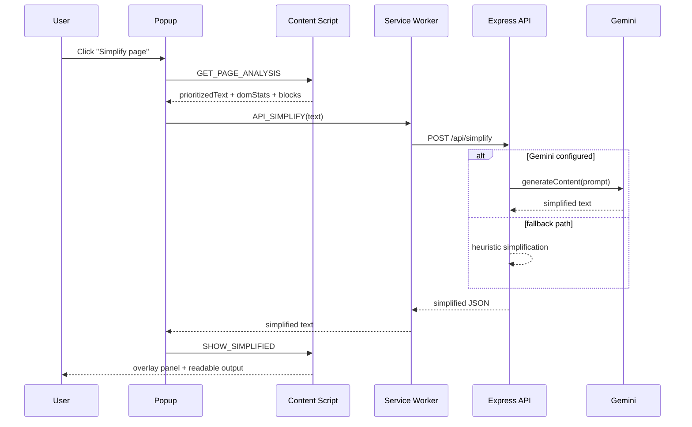
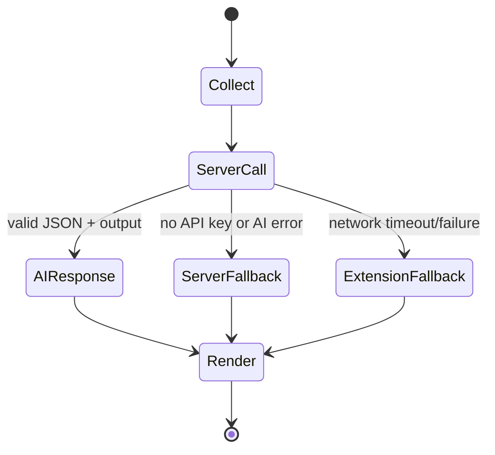

# Neuro-Inclusive Web Interface

A production-minded Chrome Extension (Manifest V3) + Node.js API that lowers web reading friction for neurodivergent users (ADHD, dyslexia, autism) through adaptive UI controls, text simplification, summarization, explainability, and cognitive-load scoring.

## 1) Problem and Proposed Impact

### Problem

Many websites combine dense language, long paragraphs, high visual clutter, and frequent context switches (ads, sidebars, popups). This increases cognitive overhead and disproportionately affects neurodivergent readers.

### Proposed Impact

Neuro-Inclusive Web Interface enables users to:

- reduce visual clutter and sensory overload on any page
- simplify and summarize complex text quickly
- get low-friction definitions for selected terms
- measure cognitive difficulty before and after interventions

Expected real-world benefit: lower reading fatigue, faster information extraction, and improved comprehension confidence on non-accessibility-first sites.

### Uniqueness

The project is not only a UI wrapper around an LLM. It combines:

- deterministic browser-side DOM and readability heuristics
- explicit data structures for ranking and term detection
- server-side AI routing with strict fallback guarantees
- measurable before/after cognitive-load metrics

## 2) System Overview

### High-level Architecture

```mermaid
flowchart LR
  U[User]
  subgraph EXT[Chrome Extension]
    P[Popup UI\nReact + Zustand]
    B[Service Worker\nAPI Proxy + LRU Cache]
    C[Content Script\nDOM Analysis + Styling]
  end
  subgraph API[Node/Express API]
    R1[/simplify]
    R2[/summarize]
    R3[/cognitive-load]
    R4[/define]
    R5[/importance-heatmap]
    G[Gemini Optional]
  end

  U --> P
  P --> C
  P --> B
  B --> R1
  B --> R2
  B --> R3
  B --> R4
  B --> R5
  R1 --> G
  R2 --> G
  R3 --> G
  R4 --> G
  R5 --> G
```

### Request/Response Sequence



### Reliability/Fallback State Model



## 3) Core Logic, DS/Algorithms, and AI Technique

### A) DOM understanding and block classification

Implemented in `extension/src/content/domPipeline.ts`:

- breadth-first traversal with safety caps (`MAX_TRAVERSAL_NODES`, `MAX_TEXT_CHARS`, `MAX_BLOCKS`)
- category classifier (`main-content`, `navigation`, `ads`, `popup`, `sidebar`, `dense-text`, `other`)
- branch skipping for low-value UI regions
- visibility-aware relevance scoring

This provides deterministic structure even when AI is unavailable.

### B) Data structures used correctly

1. `ComplexWordTrie` (`extension/src/shared/complexWordTrie.ts`)
- Detects multi-token complex terms like "executive function" efficiently.
- Supports scalable term matching over extracted text blocks.

2. `PriorityQueue` max-heap (`extension/src/shared/priorityQueue.ts`)
- Ranks candidate blocks by dynamic priority (visibility, proximity, relevance, category, term density).
- Used in viewport-aware prioritization for importance and summarization input quality.

3. `LruCache` with TTL (`extension/src/background/lruCache.ts`)
- Caches successful API responses in the service worker.
- Reduces repeated calls, latency, and token/API usage.
- Separate TTLs per route type (`simplify`, `summarize`, `define`, `importance`, `cognitive`).

### C) Cognitive-load scoring pipeline

Implemented in `extension/src/shared/cognitiveLoad.ts`:

- combines sentence complexity, syllable burden, paragraph length, clutter, heading density, and jargon load
- outputs a normalized score in [0, 100] plus interpretable factor breakdown

This enables quantitative before/after comparisons for accessibility interventions.

### D) AI technique and prompt engineering

Implemented in `server/src/lib/prompts.ts` + route handlers:

- route-specific instruction prompts (simplify, summarize, define, cognitive-load JSON, importance ranking)
- bounded input size to control cost and latency
- strict JSON parsing and safe fallback on malformed output
- optional Gemini use (`GEMINI_API_KEY`) without embedding keys in extension bundle

### E) Architectural scalability choices

- extension-server separation keeps secrets off client
- bounded payload sizes prevent runaway memory and token usage
- stateless API routes support horizontal scaling
- caching and deterministic fallback preserve performance under partial outages

## 4) Feature Set

- readability controls: font size, line height, spacing, themes
- cognitive profiles: default, ADHD, dyslexia, autism presets
- distraction reduction and focus mode
- difficult-term highlighting
- importance heatmap (heuristic or AI-blended ranking)
- simplify page (AI first, deterministic fallback)
- smart summaries (TL;DR, bullets, key points)
- explain selected term
- cognitive load scoring with optional server blend

## 5) Repository Structure

```text
.
|- extension/           Chrome MV3 extension (React popup + content + SW)
|- server/              Express API and Gemini integration
|- tests/               Unit and API test scripts
|- scripts/             Smoke-test and evaluation runners
|- docs/evaluation/     Synthetic benchmark dataset and generated results
`- README.md
```

## 6) Environment Setup

### Prerequisites

- Node.js 18+
- npm 9+
- Google Chrome (for unpacked extension load)
- Optional: Gemini API key from https://aistudio.google.com/apikey

### Install dependencies

From repository root:

```bash
npm install
```

### Configure server environment

`server/.env.example` is included.

Create `server/.env` with (optional) values:

```env
GEMINI_API_KEY=your_key_here
GEMINI_MODEL=gemini-2.0-flash
PORT=3000
```

If `GEMINI_API_KEY` is omitted, the system still works in deterministic fallback mode.

## 7) Build and Run

### Terminal 1: Start API server

```bash
npm run dev:server
```

Health check:

- `GET http://localhost:3000/health`

### Terminal 2: Build extension

```bash
npm run build:extension
```

For watch mode while iterating:

```bash
npm run dev:extension
```

### Load extension in Chrome

1. Open `chrome://extensions`
2. Enable Developer mode
3. Click Load unpacked
4. Select `extension/dist`

## 8) How to Use (Demo Flow)

1. Open a long article page (not `chrome://` pages).
2. Open the extension popup.
3. Optionally choose profile (`ADHD`, `Dyslexia`, `Autism`).
4. Click `Apply to page`.
5. Click `Score cognitive load`.
6. Click `Simplify page` and compare before/after score.
7. Try `TL;DR` or bullet summary.
8. Select a term on the page and click `Explain`.

## 9) API Contract

| Method | Endpoint | Body |
|---|---|---|
| GET | `/health` | - |
| POST | `/api/simplify` | `{ "text": "..." }` |
| POST | `/api/summarize` | `{ "text": "...", "mode": "tldr" \| "bullets" }` |
| POST | `/api/cognitive-load` | `{ "text": "...", "domStats": {...} }` |
| POST | `/api/define` | `{ "text": "..." }` |
| POST | `/api/importance-heatmap` | `{ "text": "...", "domStats": {...}, "blocks": [...] }` |

## 10) Testing and Evaluation Evidence

### A) Automated tests

Run unit tests:

```bash
npm test
```

Current result snapshot (local run on 2026-04-05):

- cognitive-load tests: 10/10 passed
- data-structure tests: 12/12 passed
- profile tests: 24/24 passed
- fallback tests: 9/9 passed
- total unit checks: 55 passed, 0 failed

Run API route checks (server required):

```bash
npm run test:api
```

Current result snapshot (local run on 2026-04-05):

- API checks: 30 passed, 0 failed

Run smoke test:

```bash
npm run smoke-test
```

Smoke test confirms all core routes return valid responses in fallback mode when Gemini key is missing.


